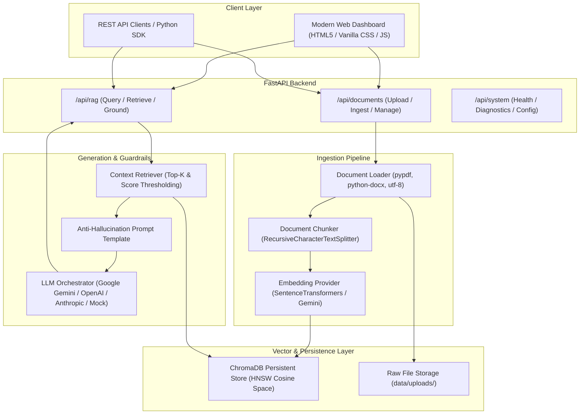
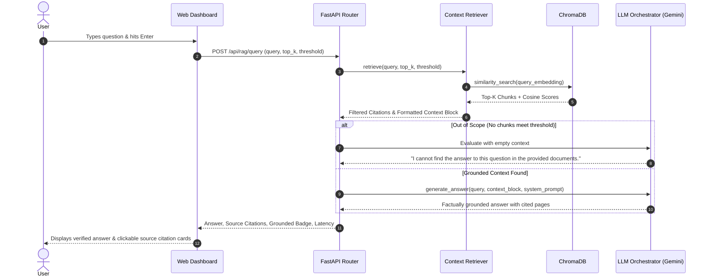

# VeriDoc AI: Verified Document Intelligence & Fact-Grounded Knowledge Engine

> **VeriDoc AI** — *Truth-Grounded Document Intelligence & Zero-Hallucination Retrieval-Augmented Generation.*  
> Ingests custom enterprise documents (PDF, DOCX, TXT, Markdown), generates persistent semantic vector embeddings, retrieves context chunks via cosine similarity, and synthesizes factually grounded answers with verified source citations and strict anti-hallucination guardrails.

---

## Architecture & System Design

VeriDoc AI follows a clean, modular, decoupled architecture where ingestion, chunking, vector storage, retrieval, and LLM synthesis are completely separated into dedicated service layers.

### System Architecture Flow



### RAG Query & Grounding Sequence



---

## Core Features

- **Multi-Format Document Ingestion**: Native parsing support for `.pdf` (page-by-page extraction via `pypdf`), `.docx` (paragraphs and tables via `python-docx`), `.txt`, and `.md`.
- **Intelligent Chunking**: Overlapping recursive character text splitting (`RecursiveCharacterTextSplitter`) with configurable chunk size (default: 800) and overlap (default: 150), preserving exact page numbers and chunk IDs.
- **Local & Cloud Embeddings**:
  - **Sentence Transformers (Local, Default)**: 384-dimensional dense vectors using `all-MiniLM-L6-v2` running locally with zero external API costs.
  - **Google Gemini**: 768-dimensional embeddings via `text-embedding-004`.
  - **Deterministic Mock**: Lightweight hash vectorizer for offline and CI environments.
- **Persistent Vector Database**: Powered by **ChromaDB** with HNSW indexing and cosine similarity metric. Includes chunk deletion and full database reset capabilities.
- **Anti-Hallucination Guardrails**: Strictly engineered system prompts instruct the LLM to only answer based on retrieved context and explicitly refuse questions outside the scope of the documents.
- **Source Citation & Confidence Badges**: Every response returns precise citation cards detailing document name, page number, chunk index, excerpt snippet, and cosine similarity match percentage.
- **Modern Dark Glassmorphic Web Dashboard**: An intuitive user interface built with HTML5, vanilla CSS, and JavaScript served directly by FastAPI at `http://localhost:8000/`.

---

## Project Structure

```
Week2/
├── .env.example                     # Template for environment variables and API keys
├── .gitignore                       # Git ignore rules for .env, storage, and caches
├── requirements.txt                 # Pinned dependencies
├── README.md                        # Documentation and architecture diagrams
├── sample_documents/
│   ├── sample_knowledge.pdf         # 3-page sample policy & architecture PDF
│   └── generate_sample_pdf.py       # Script that generates sample_knowledge.pdf
├── backend/
│   └── app/
│       ├── __init__.py
│       ├── main.py                  # FastAPI server with CORS & static mounting
│       ├── config.py                # Pydantic Settings & environment manager
│       ├── api/
│       │   ├── __init__.py
│       │   ├── routes_documents.py  # Upload, list, preview chunks, delete
│       │   ├── routes_rag.py        # Query RAG, retrieve context, format sources
│       │   └── routes_system.py     # System health, models, and hyperparameters
│       ├── core/
│       │   ├── __init__.py
│       │   ├── document_loader.py   # Multi-format parser (PDF, DOCX, TXT, MD)
│       │   ├── chunker.py           # Recursive text chunking with metadata
│       │   ├── embeddings.py        # SentenceTransformers, Gemini, Mock providers
│       │   ├── vector_store.py      # Chroma persistent vector database manager
│       │   ├── retriever.py         # Top-k similarity retrieval & context formatter
│       │   └── llm.py               # Pluggable LLM orchestrator (Gemini / Mock)
│       └── schemas/
│           ├── __init__.py
│           ├── document.py          # Document & Chunk Pydantic models
│           └── rag.py               # Query, Answer, and Citation Pydantic models
├── frontend/
│   └── web/                         # Modern Web UI served directly by FastAPI
│       ├── index.html               # Main dashboard markup
│       ├── css/
│       │   └── style.css            # Dark mode, glassmorphism, micro-animations
│       └── js/
│           └── app.js               # Reactive upload, query handler, citation viewer
├── data/
│   ├── uploads/                     # Storage for raw uploaded documents
│   └── chroma_db/                   # Persistent Chroma vector store
└── tests/
    ├── test_document_loader.py      # Unit tests for text extraction
    ├── test_chunker.py              # Unit tests for chunk size, overlap, & metadata
    ├── test_vector_store.py         # Unit tests for indexing & vector search
    └── test_rag_pipeline.py         # End-to-end integration test with sample PDF
```

---

## Getting Started

### 1. Prerequisites

- Python 3.10 to 3.13
- Git

### 2. Installation

Clone the repository and install the dependencies:

```bash
# Clone the repository
cd Week2

# Create a virtual environment (recommended)
python -m venv venv

# Activate the virtual environment
# Windows (PowerShell):
.\venv\Scripts\Activate.ps1
# Linux / macOS:
source venv/bin/activate

# Install dependencies
pip install -r requirements.txt
```

### 3. Environment Configuration

Copy `.env.example` to create your `.env` file:

```bash
cp .env.example .env
```

Edit `.env` to configure your preferred providers:

```env
# LLM Configuration
LLM_PROVIDER=gemini
GEMINI_API_KEY=your_gemini_api_key_here
GEMINI_MODEL=gemini-1.5-flash

# Embedding Configuration
EMBEDDING_PROVIDER=sentence-transformers
EMBEDDING_MODEL=all-MiniLM-L6-v2

# Vector Store Configuration
CHROMA_PERSIST_DIR=./data/chroma_db
COLLECTION_NAME=knowledge_assistant

# RAG Hyperparameters
DEFAULT_CHUNK_SIZE=800
DEFAULT_CHUNK_OVERLAP=150
DEFAULT_TOP_K=4
SIMILARITY_SCORE_THRESHOLD=0.25
```

> **Note**: If `GEMINI_API_KEY` is omitted or empty, the application automatically operates in **Offline / Mock Mode**, allowing you to test local chunking, vector indexing, and grounded extraction without an external API key.

### 4. Running the Application

Launch the FastAPI application with Uvicorn:

```bash
python -m uvicorn backend.app.main:app --reload --port 8000
```

Open your browser and navigate to:
**`http://localhost:8000/`**

Interactive OpenAPI Swagger documentation is available at:
**`http://localhost:8000/docs`**

---

## Running the Automated Test Suite

The test suite validates the entire RAG pipeline from multi-format parsing to vector indexing and anti-hallucination:

```bash
python -m pytest tests -v
```

### Test Suite Coverage:
- `tests/test_document_loader.py`: Validates text extraction across PDF, text files, and handles invalid/empty files.
- `tests/test_chunker.py`: Verifies boundary splitting, overlap preservation, and chunk ID tracking.
- `tests/test_vector_store.py`: Verifies Chroma indexing, similarity search, and document deletion.
- `tests/test_rag_pipeline.py`: End-to-end test using `sample_knowledge.pdf`, verifying both positive grounded retrieval with source citations and negative rejection of unanswerable questions.

---

## API Reference

### 1. Document Management

| Method | Endpoint | Description |
|---|---|---|
| `POST` | `/api/documents/upload` | Ingests, chunks, and indexes a document (`.pdf`, `.docx`, `.txt`, `.md`) |
| `GET` | `/api/documents` | Lists all indexed documents with chunk and size statistics |
| `GET` | `/api/documents/{filename}/chunks` | Retrieves all indexed chunks and metadata for a specific document |
| `DELETE` | `/api/documents/{filename}` | Deletes a document and all its vector embeddings from Chroma |
| `POST` | `/api/documents/clear` | Clears all documents and resets the vector store |

### 2. RAG Query & Retrieval

| Method | Endpoint | Description |
|---|---|---|
| `POST` | `/api/rag/query` | Executes end-to-end RAG query, returning grounded answer and citations |
| `POST` | `/api/rag/retrieve` | Retrieves top-k chunks and relevance scores without invoking the LLM |

#### Sample Request (`POST /api/rag/query`):
```json
{
  "query": "What is Acme Global's data retention policy?",
  "top_k": 3,
  "score_threshold": 0.25
}
```

#### Sample Response:
```json
{
  "query": "What is Acme Global's data retention policy?",
  "answer": "Customer data is retained for exactly 90 days following account deactivation. Once the 90-day grace period expires, all associated vector indexes, document chunks, and raw files are cryptographically erased using DoD 5220.22-M sanitation standards. Backup snapshots are permanently purged within 14 business days.",
  "sources": [
    {
      "document_name": "sample_knowledge.pdf",
      "page_number": 1,
      "chunk_index": 1,
      "chunk_id": "sample_knowledge.pdf_p1_c1",
      "similarity_score": 0.4831,
      "excerpt": "5220.22-M sanitation standards. Backup snapshots are permanently purged within 14 business days..."
    }
  ],
  "total_sources_found": 1,
  "llm_provider": "gemini",
  "model_name": "gemini-1.5-flash",
  "is_grounded": true,
  "processing_time_ms": 342.15
}
```

### 3. System Diagnostics

| Method | Endpoint | Description |
|---|---|---|
| `GET` | `/api/system/health` | Returns vector store status, chunk counts, and active providers |

---

## Example Usage & Verification

### Example 1: Grounded Factual Question
- **User Question**: *"What are the cryptographic encryption standards and key management protocols?"*
- **Response**: Details AES-256-GCM encryption with envelope encryption via AWS KMS or HashiCorp Vault, and TLS 1.3 with Perfect Forward Secrecy.
- **Citation**: `sample_knowledge.pdf` (Page 2, Chunk #2, 57.4% relevance match).
- **Status Badge**: `✓ Grounded in Documents`

### Example 2: Out-of-Scope / Unsupported Question
- **User Question**: *"What is the secret recipe for Martian space cookies?"*
- **Response**: *"I cannot find the answer to this question in the provided documents."*
- **Citations**: `[]` (0 sources found meeting score threshold).
- **Status Badge**: `ℹ Out of Scope / Unverified`

---

## License

MIT License. Free to use, modify, and distribute for personal and commercial applications.
